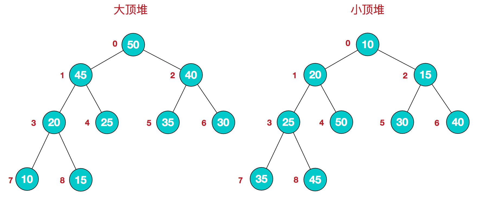

# 堆排序（Heapsort）

> 利用堆这种数据结构所设计的一种排序算法。
> 堆积是一个近似完全二叉树的结构，并同时满足堆积的性质：
> 即子结点的键值或索引总是小于（或者大于）它的父节点。

1. 堆结构

    堆是完全二叉树：每个结点的值都大于其左右子节点的值（大顶堆），或者每个结点的值都小于其左右子节点的值（小顶堆）

    

    对每层的结点进行编号，映射到数组里就是
    

    堆的定义用公式的形式表达：
    
   - 大顶堆：$arr[i] \geq arr[2i+1] \ \&\&\  arr[i] \geq arr[2i+2]$ 
    
   - 小顶堆：$arr[i] \leq arr[2i+1] \ \&\&\  arr[i] \leq arr[2i+2]$ 

2. 思路概述：

    （初始大顶堆，结果为升序）

   - 将初始待排序关键字序列 $(R_1,\ R_ 2,\ \cdots,\ R_n)$构建成大顶堆，此堆为初始的无序区；
   - 将堆顶元素 $R[1]$ 与最后一个元素 $R[n]$ 交换，此时得到新的无序区 $(R_1,\ R_2,\ \cdots,\ R_n-1)$ 和新的有序区 $(Rn)$ ,且满足 $R[1,\ 2,\ \cdots,\ n-1]\leq R[n]$ ；
   - 由于交换后新的堆顶 $R[1]$ 可能违反堆的性质，因此需要对当前无序区 $(R_1,\ R2, \ \cdots, \ R_n-1)$调整为新堆，然后再次将 $R[1]$ 与无序区最后一个元素交换，得到新的无序区 $(R_1, \ R_2, \ \cdots, \ R_n-2)$和新的有序区 $(R_n-1, \ R_n)$。不断重复此过程直到有序区的元素个数为 $n-1$，则整个排序过程完成。

    

3. 算法图解

    堆排序的基本思想是：将待排序序列构造成一个大顶堆，此时，整个序列的最大值就是堆顶的根节点。将其与末尾元素进行交换，此时末尾就为最大值。然后将剩余n-1个元素重新构造成一个堆，这样会得到n个元素的次大值，并与n-1位置的元素再进行交换，此时n-1位置就为次大值。如此反复执行，便能得到一个有序序列了

    
    

4. 分析

    堆排序的时间复杂度，主要在初始化堆过程和每次选取最大数后重新建堆的过程

    堆排序的时间复杂度为：$O(nlog2n)$；
    因为堆排序就是选择排序，空间复杂度为常数：$O(1)$

    在一个长为 $n$ 的序列，堆排序的过程是从第 $\frac{n}{2}$ 开始和其子节点共3个值选择最大（大顶堆）或者最小（小顶堆），这3个元素之间的选择当然不会破坏稳定性。
    但当为 $\frac{n}{2} - 1$ ， $\frac{n}{2} - 2$ ，$\cdots$，$1$ 这些个父节点选择元素时，就会破坏稳定性。
    有可能第 $\frac{n}{2}$ 个父节点交换把后面一个元素交换过去了，而第 $\frac{n}{2} - 1$ 个父节点把后面一个相同的元素没有交换，那么这2个相同的元素之间的稳定性就被破坏了。所以，堆排序**不是稳定的**排序算法。

[代码](code/堆排序.cpp)