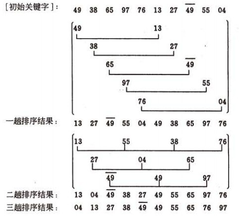

# 希尔排序(Shell's Sort)

> 希尔排序(Shell's Sort)是插入排序的一种，又称“缩小增量排序”（Diminishing Increment Sort），是直接插入排序算法的一种更高效的改进版本。希尔排序是非稳定排序算法。该方法因D.L.Shell于1959年提出而得名。

1. 概述：
    
    希尔排序是把记录按下标的一定增量分组，对每组使用直接插入排序算法排序；随着增量逐渐减少，每组包含的关键词越来越多，当增量减至1时，整个文件恰被分成一组，算法便终止。

2. 流程：

    将原序列拆分成若干子序列，进行直接插入排序。
    - 选择一个增量序列 ${t_1, t_2, \cdots, t_k}$ ，其中 $t_i > t_j$ ， $t_k=1$ ；
    - 按增量序列个数 k，对序列进行 k 趟排序；
    - 每趟排序，**根据对应的增量 $t_i$ ，将待排序列分割成若干长度为m的子序列**，分别对各子表进行直接插入排序。仅增量因子为1 时，整个序列作为一个表来处理，表长度即为整个序列的长度。

    
    
3. 示例：
    
    设定增量序列为$gap = \{5,  2,  1\}$ 

    

4. 注意问题：
   
   关于稳定性
   >  由于多次插入排序，我们知道一次插入排序是稳定的，不会改变相同元素的相对顺序，但在不同的插入排序过程中，相同的元素可能在各自的插入排序中移动，最后其稳定性就会被打乱，所以shell排序是不稳定的。

   关于增量序列选取：
   > 目前还没有人给出选取最好的增量因子序列的方法。增量因子序列可以有各种取法，有取奇数的，也有取质数的，但需要注意：增量因子中除 1 外没有公因子，且最后一个增量因子必须为1。

[代码](code/希尔排序.cpp)