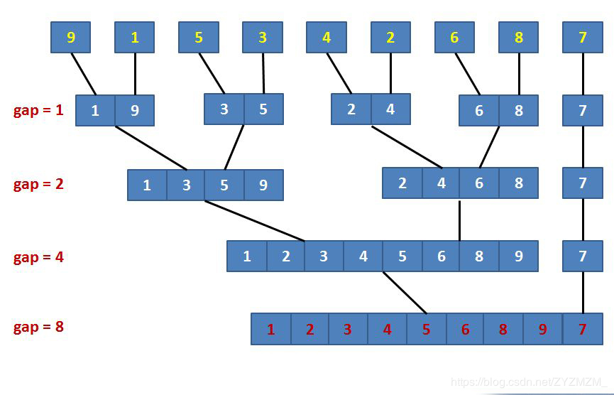

# 归并排序（Merge）

> 定义：将两个（或两个以上）有序表合并成一个新的有序表，即把待排序序列分为若干个子序列，每个子序列是有序的。然后再把有序子序列合并为整体有序序列。

1. 概述

    分治法（Divide and Conquer）的典型应用。分治法即把一个复杂的问题分成两个或更多的相同或相似的子问题，再把子问题分成更小的子问题……直到最后子问题可以简单的直接求解，原问题的解即子问题的解的合并。

    基本思想：先使每个子序列有序，再使子序列段间有序。若将两个有序表合并成一个有序表，称为**2-路归并**。 

    - 把长度为 $n$ 的输入序列分成两个长度为 $\frac{n}{2}$ 的子序列；
    - 对这两个子序列分别采用归并排序；
    - 将两个排序好的子序列合并成一个最终的排序序列。

    
    

2. 复杂度分析

    时间复杂度平均为 $O(nlog_2n)$，最好情况 $O(nlog_2n)$，最坏相同。

    空间复杂度为 $O(n)$ ，申请临时数组空间为 $n$。

[cpp](code/归并排序.cpp)