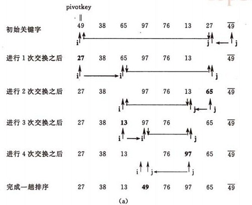

# 快速排序(Quick Sort)

> 基本思想是：通过一趟排序将要排序的数据分割成独立的两部分，其中一部分的所有数据都比另外一部分的所有数据都要小，然后再按此方法对这两部分数据分别进行快速排序，整个排序过程可以通过递归进行，以此达到整个数据变成有序序列，快速排序也可通过非递归的方式实现。

快速排序使用分治法来把一个串（list）分为两个子串（sub-lists）。具体算法描述如下：

> - 从数列中挑出一个元素，称为 “基准”（pivot）；
> - 重新排序数列，所有元素比基准值小的摆放在基准前面，所有元素比基准值大的摆在基准的后面（相同的数可以到任一边）。在这个分区退出之后，该基准就处于数列的中间位置。这个称为分区（partition）操作（一次划分算法）；
> - 递归地（recursive）把小于基准值元素的子数列和大于基准值元素的子数列排序。（也可使用非递归算法）

### 一次划分算法（挖坑）
- 设置两个变量i、j，排序开始的时候：i=0，j=N-1；
- 以第一个数组元素作为关键数据，赋值给key，即key=A[0]；
- 从 j 开始向前搜索，即由后开始向前搜索( j-- )，找到第一个小于key的值A[ j ]，将A[ j ]和A[ i ]互换；
- 从 i 开始向后搜索，即由前开始向后搜索( i++)，找到第一个大于key的A[ i ]，将A[ i ]和A[ j ]互换；
- 重复第3、4步，直到 i=j，将key 填入 A[ i ]中

*!!!：* 当以第一个数组元素为基准数时，搜索必须先从后向前进行，当以最后一个数组元素为基准数时，搜索必须先从前向后进行。

 > *左右指针——和挖坑法类似，但不是挖出来把其他位置的放到这个坑里*  （--> 暂时没理顺）
 > - 选取一个关键字(key)作为枢轴，一般取整组记录的第一个数/最后一个为枢轴。
 > - 设置两个变量left = 0;right = N - 1;
 > - 从left一直向后走，直到找到一个大于key的值，right从后至前，直至找到一个小于key的值，然后交换这两个数。
 > - 重复第三步，一直往后找，直到left和right相遇，这时将key放置left的位置即可。
 > - 然后再继续进行排序，划为子问题进行解决

### 基准数（key）选取
1. 固定位置
    
    选取第一个或最后一个元素作为基准值。
    例如上面“挖坑”里用的就是固定选取第一个数为基准。

2. 随机位置
    
    选取待排序列中任意一个数作为基准值，选出的任意值与序列第一个元素交换，可然后复用Partition函数（将随机交换后的0号元素作为基准）
    
    > 有种先随机、后固定位置的赶脚

3. 三分，取中间数

    arr[mid] <= arr[low] <= arr[high]，使得arr[low]处于三数中的中间值，然后复用Partition函数
    > 将这三个数排序，然后把最小的放中间，最大的放最后，中间的放前面

### 快排的调用

1. 递归调用
    
    通过Partition来实现划分，并递归实现前后的划分。

2. 非递归调用

    （先空着，后面学懂了再补）

[代码](code/快速排序.cpp)